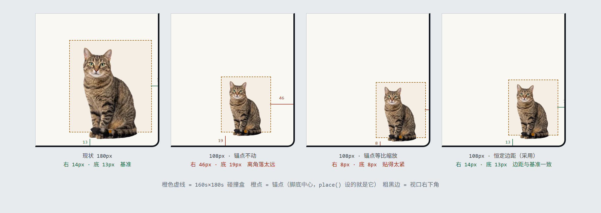

# Zoe 手机端布局改造 · 设计文档

2026-08-31 定案。改动范围限手机端（`innerWidth < 768`），桌面端零改动。

---

## 1. 要解决的问题

Sigao 在手机上发现两点：

1. Zoe 太大。实测 iPhone 14（390×844）上她的碰撞盒 160×180 占屏宽 **41%**，桌面 1440 宽时只占 11%——横向占比是桌面的 3.7 倍。
2. 打开对话框后她被完全盖住。面板 `bottom:80 / right:20`，宽度几乎横跨整屏，实测遮挡 **60%**，只露脚下一截。

两者耦合：缩小之后纵向才腾得出让两者共存的空间。

---

## 2. 决策摘要

| 项 | 决定 |
|---|---|
| 角落猫尺寸 | **108px**（手机端），桌面维持 180px |
| 面板打开时的布局 | **C 方案 · 进头部**——角落猫退场，面板头部放头像 |
| 头像图源 | 全身静帧 `zoe-sit.webp`，固定坐姿 |
| 头像位置 | 面板头部**左侧**，副标题右让 |
| 头像尺寸 | **按高 40px**（实际 23×40） |
| 头像语义 | `aria-hidden` 纯装饰，不可点 |
| 头像是否有动作 | 静态 |
| 手机端动画层 | 开 **微动层** + **进场秀**；不开切页反应、不开睡眠、不开聊天联动 |
| 问候气泡 | 手机端保留，偏移随尺寸联动 |
| 回头客问名 | 手机端移出气泡，改为**面板内卡片**；桌面端不变 |
| 页面缩放 | Zoe **不跟随**放大，物理尺寸恒定 |
| 让位规则 | 不做 |
| 断点 | 768，与既有 `Z.interactive` 一致 |

---

## 3. 依据

### 3.1 尺寸 108px 怎么来的

**触控不构成约束。** Parhi/Karlson/Bederson（MobileHCI 2006）单手拇指研究：离散点击 9.2mm 足够，且超过 9.6mm 后错误率不再显著改善。业界收敛于 Apple 44pt / Material 48dp（≈9mm）/ WCAG 2.5.5 44px。取最严的 48px，Zoe 要缩到该值需 0.27 倍——在任何候选区间内都碰不到下限。

**细节下限约 84px。** 素材源 600px 高，96px 在 DPR-3 上仍有 288 设备像素。实测梯度到 84px 眼睛仍清晰。（早期"低于 108 就糊"的判断有误，已修正。）

**上界由屏占比定。** 桌面 1440×900 下她占面积 2.22%。映射到 390×844：按面积匹配得 91px，按对角线匹配得 88px。另一锚点：碰撞盒宽 96px 恰等于 Material 大号 FAB（96dp）——主流设计体系里常驻启动器的最大规格，反推猫高 108px。

取推导带的上沿：**108px**，占宽 24.6%、占面积 3.1%（约桌面比例的 1.4 倍，作为手机端的合理宽容）。

### 3.2 头像 40px 怎么来的

**惯例基线**：Material 带头像列表——头像 40dp、正文行高 24sp，即 **头像 ≈ 1.67 × 单行行高**。

**但惯例针对实心圆。** bjango 的光学补正给出定量：圆需放至 **112.84%**（= √(4/π)）才与同尺寸方块等重——惯例背后的真实度量是视觉面积。

**本素材实测**：包围盒 211×360，alpha 加权墨量占包围盒 **68.1%**，宽高比 0.586。与实心圆填充率 π/4 = 78.5% 相比，等墨量系数 **k = 1.40**。

合并：`1.67 × 1.40 = 2.33 × 行高`。副标题行高实测 18px → **42px**，落档 **40px**。

40px 的猫 ≈ 28.6px 圆头像，低于 Material 的 40dp 标准一档——这是对的：身份由名牌（"驺虞 · 思高的猫"）承担，头像是辅助而非主标识。

### 3.3 为何 C 方案

C 方案让猫与面板**从不同时出现**，因而一并消解了三个问题：

- 小屏共存：320×568（WCAG 1.4.10 反流下限）上面板可拿满高度
- 让位规则：不再需要
- 「余光干扰 vs 她在听」的张力：聊天期间她本就不在角落

---

## 4. 详细设计

### 4.1 尺寸与定位

引入手机端猫高，页面缩放时物理尺寸恒定：

```
catH = mobile ? min(108, 0.277 × innerWidth, 0.20 × innerHeight) : 180
s    = catH / 180
```

`0.277 = 108/390`、`0.20 = 108/540`。页面放大时有效视口的 CSS px 变少，算出的 CSS 尺寸同比缩小，乘回缩放倍数后物理尺寸不变。实测：390×844 上 100%/150%/200% 三档，碰撞盒物理尺寸恒为 96×108。

200% 时 CSS 盒为 48×54，仍 ≥ WCAG 2.5.5 的 44 与 Material 的 48；再往上（≥250%）会跌破，但届时可用高度已不足以容纳面板，属于面板自身的边界问题，不在本次范围。

随 `s` 联动的量：

| 位置 | 现值 | 改为 |
|---|---|---|
| `:571` 视频 | `height:180px; bottom:-15px` | `height: catH; bottom: -(15×s)` |
| `:186` `.zoe-stage` | `160×180; margin -80/-180` | `160s × 180s; margin -80s / -180s` |
| `:47` `#zoe-still` | `height:150px` | `height: 150×s` |
| `:556` `place()` 锚点 | `(innerWidth-94, innerHeight-28)` | `(innerWidth - (K + 80s), innerHeight - (13 + 15s))`，K=桌面 14 / 手机 0 |
| `:203` `#zoe-bubble` | `right:-76px; bottom:192px` | `right: -(80s - 4); bottom: 165s + 27` |

锚点公式的意图是**保持视觉边距恒定**。现状 s=1 时，碰撞盒右缘距视口右缘 14px、画面底缘距视口底缘 13px；缩小后若不刻意维持，这两个边距都会走样：



| 做法 | 右边距 | 底边距 | 结果 |
|---|---|---|---|
| 现状 180px（基准） | 14px | 13px | — |
| 108px，锚点不动（`R=94, B=28`） | 46px | 19px | 离角落太远，像浮在半空 |
| 108px，锚点等比缩放（`R=94s, B=28s`） | 8.4px | 7.8px | 贴得太紧，快蹭到屏幕边 |
| **108px，恒定边距（`R=K+80s, B=13+15s`）** | **K** | **13px** | 可控 |

`80s`/`15s` 分别是碰撞盒半宽与画面底缘相对锚点的溢出量；`13` 是要保住的底边距。

**右边距常数 K：桌面 14（维持现状 94），手机端 0。**

初版沿用 14，Sigao 审核时反馈「还能再往右一些」。查下来是因为 14 量的是**碰撞盒**边缘，而画幅两侧各有约 `20s` px 的透明留白——看得见的猫离屏幕边比盒子远得多。按实际轮廓逐段实测（s=0.6）：

| K | 坐姿系可见右边距 | 可见底边距 | 偏差 |
|---|---|---|---|
| 14 | 35.7px | 22.2px | **+13.5**（右是底的 1.6 倍，读起来没坐进角里） |
| 6 | 27.7px | 22.2px | +5.5 |
| 1 | 22.7px | 22.2px | +0.5 |
| **0** | **21.7px** | **22.2px** | **−0.5** |

取 **K=0**：两个方向的可见留白基本相等，且碰撞盒右缘正好与视口齐平——画幅宽 96px = 盒宽 96px，不越界、不裁切、可点区完整保留。

坐姿系（idle / listen / think / groom / yawn）轮廓一致，按它取值；趴姿（loaf）横向更长，会再往右探出约 9px，属姿势本身特性，仍在屏内。

两式在 s=1、K=14 时还原为现值 94 / 28。气泡偏移同理随 `--zs` 联动。

### 4.2 面板与头像

面板（`:67`）手机端改为 `bottom-3`，高度 `min(540px, calc(100dvh - 2rem))`；`md:` 断点以上一切不变。

头部（`:70`）加头像：

```html
<header class="panel-head">
  
  <p class="panel-sub">…</p>
  <button id="chat-close">…</button>
</header>
```

- `.chat-avatar { height: 40px; width: auto; flex: none; align-self: flex-end; margin-bottom: -10px; }`
- 仅手机端显示（`md:hidden` 或等价媒体查询）
- 头部由 `align-items: center` 改为 `flex-end`，副标题 `flex: 1`
- 头部总高从 45px 增至 57px

窄视口下副标题可能折成两行、头部再增高，属可接受降级。

### 4.3 角落猫的进退场

- 面板打开（手机端）：锚点 `opacity: 0; pointer-events: none`，200ms 淡出，与面板 `chat-pop` 开合对称
- 面板关闭：淡入，回到 `idle`
- 头像固定坐姿，不跟随角落当前姿势——她在角落可能正趴着，但头像是"正式肖像"

### 4.4 动画层

手机端 `Z.interactive` 仍为 `false`（聊天联动、切页反应、睡眠、hover 唤醒、彩蛋均维持关闭）。**新增两处例外**：

**微动层**：`scheduleMicro()`（`:741`）的守卫放宽至手机端。舔爪/打哈欠，2–3 分钟随机，滚动中不播。素材 `yawn`(232KB) + `groom`(892KB) 今天已在下载（见 4.6），零增量。

> 取舍记录：NN/g 明确反对页面上的持续运动，Burke 等（ToCHI 2005）也证明余光里的动效会拖慢视觉搜索、抬高主观负荷，且损耗**不来自注视**。微动层正是这类成本的主要来源。Sigao 权衡后仍决定保留——她是这个站的角色而非装饰。若上线后觉得吵，调 `T.microMin/microMax`（现为 2–3 分钟）即可，是一行改动。

**进场秀**：`:1306` 的分支改为手机端也走 `entryShow()`。两处连带影响必须一并处理：

1. **气泡会随之出现**。`entryShow()` 末尾会冒问候气泡，这是手机端此前完全没有的行为。气泡保留，但定位偏移必须按 4.1 的公式随 `s` 联动，否则会飘在猫头上方过高处。**问名表单则移出气泡，改为面板内卡片（见 4.5）。**
2. **深夜分支不适用**。`nightInit()`（`:809`）让她进站即睡，而唤醒依赖 hover 或聊天联动——手机端两者都没有，睡眠层也不开，一睡即本会话叫不醒。故手机端**不走 `nightInit`**，任何时段一律 `entryShow`。

### 4.5 问名改为面板内卡片（手机端）

现状问名走气泡内联表单（`:52-58`）。C 方案下面板一开角落猫就消失，气泡无处依附，故手机端改为面板内的一张卡片。

**必须守住的约束**：`:210` 的注释记录了 07-16 的决定——问名**不进对话流**，就地填完即可。搬进面板后仍不得变成一条聊天消息。

- **形态**：停靠在输入行正上方，与「常用问题」chips 同一区域的一张卡片；一行文案 + 输入框 +「好呀 / 不用啦」
- **触发**：手机端访客**打开面板**时判定，门槛沿用现状 `!profile.declined && (askCount ?? 0) < 2`
- **拒绝**：「不用啦」→ `declined = true`，永不再问，与现状一致
- **每会话至多出现一次**；出现即 `askCount += 1`
- **桌面端不变**，仍走气泡内联表单

同一功能因此有两条路径。这是「桌面端零改动」这一约定的直接代价，接受；将来若要统一到卡片，桌面端改起来也容易。

### 4.6 预热清单（顺带修一个既存浪费）

`:1314-1315` 两处 `warm()` **没有 `Z.interactive` 守卫**，而所有消费这些片段的函数在 `!Z.interactive` 时都提前 return。结果：手机端今天下载了 **2.6MB 永远播不出来的片段**（6s 拉 glance/earflick/attend/startle/sit-to-loaf 共 1485KB，20s 拉 yawn/groom 共 1125KB）。

改为按实际启用的层裁剪。手机端：

- 删除 6s 那批（切页反应与睡眠均不开）
- 保留 20s 的 `['yawn','groom']`（微动层要用）
- `entryShow()` 自身已 warm `loaf-to-sit` / `idle`（+回头客的 `wave`）

流量净变化：

| | 今天 | 改后 |
|---|---|---|
| 首次访客 | 2756KB | **1845KB** |
| 回头客（含 wave） | 2756KB | 2187KB |

**新增两层动画的同时，手机端流量反而少约 0.9MB。**

---

## 5. 明确不做

- **让位规则**（可用高不足时猫自动退场）：C 方案下两者从不共存，规则失去意义
- **切页反应**：素材虽已在下载（零增量），但仍是余光干扰，Sigao 定不做
- **睡眠层**：手机端无唤醒路径（`wake()` 只被 hover 与聊天联动调用，两者在手机端都不存在），且带 `stretch` 需多 1349KB，Sigao 定不做。随之 `nightInit()` 也不在手机端生效
- **聊天联动**（listen / think / type）：头像是静态的，无处安放
- **桌面端任何改动**

---

## 5.5 键盘态（2026-09-03 追加）

Sigao 真机验证后反馈「键盘弹出后对话框里只能看到有限信息」。垂直空间要不回来——键盘高度不归我们管，业界指南（Setproduct）也直说键盘弹起时「只显示最近两三条消息」是常态。能做的是别把剩下的空间花在装饰上，同一份指南的下一句正是「键盘打开时隐藏非必要的头部装饰」。

**实测空间账**（iPhone 14，键盘 291px，空对话）：

| | 高度 | 占面板 |
|---|---|---|
| 头部（头像 40 + 副标题） | 57px | 11% |
| 建议 chips | 98px | 18% |
| 输入区（含免责声明 25px） | 93px | 18% |
| **对话区** | **279px** | **53%** |

chips 是「给你点的」，不是「给你打字时读的」，而访客点输入框那一刻它们还占着 98px。

**做法**：输入框聚焦时给面板加 `.kbd` 类，收起 chips、头像与副标题，头部收窄到 40px（仍容得下 ✕ 钮）。免责声明保留——AI 披露不该在打字时消失。失焦即恢复。仅手机端（`innerWidth < 768`）。

用 `focus`/`blur` 而非 `visualViewport`：后者在 iOS 上地址栏收放同样会触发，分不清是不是键盘；而「聚焦输入框」本身就是要响应的意图，更直接也更跨浏览器。

**连带改动：手机端不再自动聚焦输入框。** `toggle()` 原本打开面板即 `focus()`，加上键盘态后会当场收起 chips——等于首次访客永远看不到常用问题。而自动聚焦本身在手机上也是负担：键盘在你读完问候语之前就吃掉半屏。桌面端无此代价，维持自动聚焦。

**效果**：对话区 279px → **394px（+115px）**；打开面板时 chips 正常可见。

**同时修**：对话区在容器变矮时不重新贴底。`scrollLog()` 只在追加内容时调用，键盘弹出没有新内容，`clientHeight` 一小则可滚上限变大、`scrollTop` 原地不动即离底。实测偏 11px——小于 `atBottom()` 的 40px 判据，故 `pinned` 仍为 `true`、「回到最新」也不浮现，状态自认在底部而实际不在，长回复末尾会被切掉且无提示。改为 `ResizeObserver` 观察日志容器，尺寸变化时若 `pinned` 则重新贴底。

---

## 6. 单独立项（不在本次范围）

1. **虚拟键盘埋掉输入框** —— 安卓侧已修（2026-09-01），iOS 侧待做。

   `Base.astro` 原本未声明 `interactive-widget`，走默认 `resizes-visual`：键盘弹出时布局视口与 `dvh` 均不变、`position:fixed` 不动，面板底部（输入框、常用问题、免责声明）被覆盖。**猫完全退场也不解决**——这是面板自身的缺陷，与 Zoe 无关。

   **已做**：viewport meta 加 `interactive-widget=resizes-content`，布局视口随键盘缩，面板与 `dvh` 跟着让开。

   **关于"原本有多严重"**：早期文档写的"375×667 被埋 248px"来自一个画灰块假装键盘的模拟，它假设浏览器不做任何 scroll-into-view 补偿——该假设未经验证，那个数字应视为上界而非实测。无头浏览器召不出真键盘（CDP `Emulation.setVisibleSize` 对 `visualViewport` 无效），故未能实测。修复的有效性则可验证（`resizes-content` 语义 = 布局视口变矮，可用真实的矮视口精确复刻）：

   | 机型 | 键盘 216 | 260 | 291 | 336（带联想栏） |
   |---|---|---|---|---|
   | iPhone 14 390×844 | 好 | 好 | 好 | 好 |
   | iPhone SE 375×667 | 好 | 好 | 好 | 挤（对话区 57px） |
   | 320×568 | 挤 | 挤（32px） | 挤 | 输入框仍被埋 |

   12 组里 11 组输入框可见；唯一失守的 320×568 + 336px 键盘时可用高仅 232px，面板本身就装不下，属视口过矮而非键盘方案问题。

   **副作用已测**：`resizes-content` 会让整页在键盘弹出时重排。实测三个页面（含 `Hero` 的 `100svh`、CV 的 `35vh` scroll-margin）：面板高度不变、输入框可见、**滚动位置不跳、收键盘后原样回位**。`Hero` 高度由内容决定，未受影响。

   **覆盖范围**：21 个走 `Base.astro` 的页面全部生效；另 18 个 v1 遗留页（`/about`、`/research/*`、`/talks` 等）不走该布局，但它们也没有对话框，无关。

   **待做（iOS）**：WebKit 至今不支持 `interactive-widget`，故 iOS Safari 上此修复不生效，仍需监听 `window.visualViewport` 的 `resize` 手动定位面板（用 `top` + `translateY(-100%)` 而非 `bottom`）。有状态、需处理键盘收起/转屏/地址栏收放，风险与工作量都大一档，单独评估。

2. **`ball` / `stretch` 画幅溢出被裁**。逐帧 alpha 实测：`ball`（1067×600）不透明内容跨 380–1066，按 180px 渲染时半宽 160px，溢出 160 碰撞盒 80px；按锚点 `innerWidth-94` 计算，右缘落在 `innerWidth+66`，**被视口裁掉 66px，桌面端同样如此**。`stretch` 溢出 30px、裁掉 16px。手机端缩到 108px 后溢出降至 48/18px，右缘落在 `innerWidth+2`，基本不裁——**本次改动顺带缓解，但桌面端问题仍在**。

3. **面板在 200% 页面缩放下溢出**。320×568 @200% 时面板仅剩 264px 可用，低于可用下限；与 Zoe 无关。

---

## 7. 验收标准

1. 390×844：角落猫碰撞盒 96×108，占屏宽 24.6%，盒右缘与视口齐平（K=0）；桌面右边距仍 14px
2. 页面缩放 100% / 150% / 200%：碰撞盒物理尺寸恒为 96×108
3. 打开面板：角落猫 200ms 淡出，头部出现 23×40 头像，头部高 57px
4. 320×568（反流下限）：面板可拿满高度，无横向滚动
5. 关闭面板：猫淡入并回到 idle
6. 首次进站（任意时段，含 23:00–6:00）：走进场秀，气泡尾巴正确指向猫头，不飘高
7. 微动层 2–3 分钟触发一次，滚动中不触发
8. 回头客打开面板：问名卡片出现在输入行上方，**不进对话流**；点「不用啦」后刷新再开不再出现
9. 手机端静置 5 分钟不入睡（睡眠层未启用）
10. DevTools Network 确认手机端不再下载 glance / earflick / attend / startle / sit-to-loaf / stretch
11. 桌面端（≥768）行为与改动前逐项一致，问名仍走气泡
12. 安卓 Chrome 真机：点输入框弹出键盘，输入框与发送钮仍可见；收起键盘后页面滚动位置不变
13. 手机端打开面板：常用问题 chips 可见，输入框**不**自动聚焦、键盘不弹出
14. 点输入框：chips 与头部头像/副标题收起，头部收窄至 40px，对话区涨约 115px；失焦即恢复
15. 桌面端打开面板仍自动聚焦，chips 始终可见，头部不收窄
